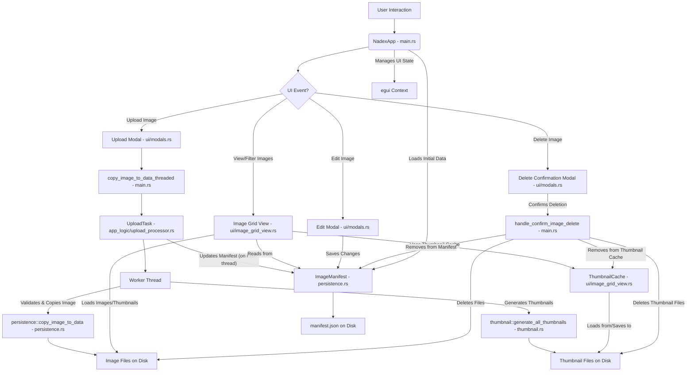

# Nadex

A desktop application for managing and viewing "nade" (e.g., smoke, flashbang, molotov) lineups for video games. Built with Rust and the egui library.

## Features

*   Upload images of nade lineups (supports common image formats).
*   Automatically generates thumbnails for quick preview.
*   Filter images by map and nade type (Smoke, Flash, Molly, HE).
*   View detailed image view with metadata.
*   Edit image metadata (map, nade type, position, notes).
*   Delete images.
*   Persistent storage of image metadata in a local manifest file.
*   Handles unique filenames for uploaded images to prevent overwriting.

## Prerequisites

*   [Rust programming language](https://www.rust-lang.org/tools/install) (latest stable version recommended).

## How to Run

1.  **Clone the repository (if you haven't already):**
    ```bash
    git clone <your-repository-url>
    cd nadex
    ```

2.  **Build and run the application:**
    ```bash
    cargo run
    ```

    The application will compile and then launch. Image data and the manifest will be stored in your system's local application data directory under a `nadex` subfolder (e.g., `C:\Users\<YourUser>\AppData\Local\nadex` on Windows).

## Project Structure (Simplified)

*   `src/main.rs`: Main application logic, UI layout, and event handling.
*   `src/persistence.rs`: Data structures for image metadata and functions for loading/saving the manifest and image files.
*   `src/thumbnail.rs`: Thumbnail generation logic.
*   `src/ui/`: Modules related to specific UI components (e.g., image grid, modals).
*   `src/app_logic/`: Modules for application-specific logic (e.g., upload processing).
*   `Cargo.toml`: Project dependencies and metadata.

## Component Interaction Diagram



