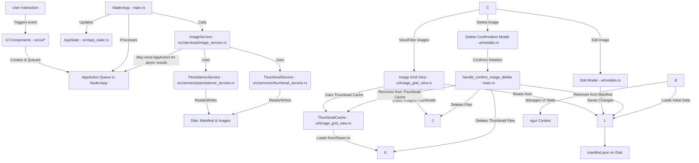

# Nadex

A desktop application for managing and viewing "nade" (e.g., smoke, flashbang, molotov) lineups for video games. Built with Rust and the egui library.

## Features

*   Upload images of nade lineups (supports common image formats).
*   Automatically generates thumbnails for quick preview.
*   Filter images by map and nade type (Smoke, Flash, Molly, HE).
*   View detailed image view with metadata.
*   Edit image metadata (map, nade type, position, notes).
*   Delete images.
*   Persistent storage of image metadata in a local manifest file.
*   Handles unique filenames for uploaded images to prevent overwriting.

## Prerequisites

*   [Rust programming language](https://www.rust-lang.org/tools/install) (latest stable version recommended).

## How to Run

1.  **Clone the repository (if you haven't already):**
    ```bash
    git clone <your-repository-url>
    cd nadex
    ```

2.  **Build and run the application:**
    ```bash
    cargo run
    ```

    The application will compile and then launch. Image data and the manifest will be stored in your system's local application data directory under a `nadex` subfolder (e.g., `C:\Users\<YourUser>\AppData\Local\nadex` on Windows).

## Project Structure (Simplified)

*   `src/main.rs`: Main application entry point, event loop (`NadexApp::update`), and top-level UI orchestration.
*   `src/app_state.rs`: Defines the central `AppState` struct holding all application state.
*   `src/app_actions.rs`: Defines the `AppAction` enum used for queuing UI events and background task results.
*   `src/persistence.rs`: Defines core data structures like `ImageManifest`, `ImageMeta`, and `NadeType`.
*   `src/services/`: Contains the business logic and interactions with external resources.
    *   `persistence_service.rs`: Handles loading/saving the manifest and image files to/from disk.
    *   `thumbnail_service.rs`: Manages on-disk thumbnail generation and deletion.
    *   `image_service.rs`: Orchestrates image-related operations (upload, delete, edit metadata), coordinating with other services.
*   `src/ui/`: Modules for specific UI components (e.g., `image_grid_view.rs`, `upload_modal_view.rs`).
*   `src/common.rs`: Shared utility functions or common types.
*   `src/tests_common.rs`: Helper functions and mock objects for testing.
*   `Cargo.toml`: Project dependencies and metadata.

## Component Interaction Diagram



