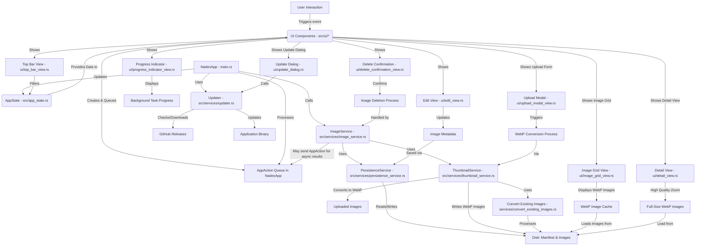

# Nadex


A desktop application for managing and viewing "nade" (e.g., smoke, flashbang, molotov) lineups for Counter-Strike. Built with Rust and the egui library.

## Features

*   Upload images of nade lineups (supports common image formats).
*   Automatically converts images to WebP format for optimal quality and performance.
*   Filter images by map and nade type (Smoke, Flash, Molly, HE).
*   View detailed image view with metadata and high-quality zoom capability.
*   Edit image metadata (map, nade type, position, notes).
*   Delete images.
*   Persistent storage of image metadata in a local manifest file.
*   Handles unique filenames for uploaded images to prevent overwriting.
*   Automatic updates via GitHub releases - stay up to date with the latest features.

## Prerequisites

*   [Rust programming language](https://www.rust-lang.org/tools/install) (latest stable version recommended).

## How to Run

1.  **Clone the repository (if you haven't already):**
    ```bash
    git clone https://github.com/cj-tomlin/nadex.git
    cd nadex
    ```

2.  **Build and run the application:**
    ```bash
    cargo run
    ```

    The application will compile and then launch. Image data and the manifest will be stored in your system's local application data directory under a `nadex` subfolder (e.g., `C:\Users\<YourUser>\AppData\Local\nadex` on Windows).

## Automatic Updates

Nadex includes an automatic update system that keeps your application up to date with the latest features and bug fixes:

1. **Check for Updates:** Click on the "Help" menu in the top-right corner, then select "Check for Updates"

2. **View Update Information:** If an update is available, the update dialog will show you the new version number and release notes

3. **Install Update:** Click the "Update Now" button to download and install the update

4. **Restart:** Once the update is complete, restart the application to use the new version

Updates are sourced from GitHub releases, ensuring a secure and reliable update mechanism.

For more detailed technical documentation on the architecture and workflows, see [DOCUMENTATION.md](./docs/DOCUMENTATION.md).

## Project Structure (Simplified)

*   `src/main.rs`: Main application entry point, event loop (`NadexApp::update`), and top-level UI orchestration.
*   `src/app_state.rs`: Defines the central `AppState` struct holding all application state.
*   `src/app_actions.rs`: Defines the `AppAction` enum used for queuing UI events and background task results.
*   `src/persistence.rs`: Defines core data structures like `ImageManifest`, `ImageMeta`, and `NadeType`.
*   `src/common.rs`: Shared utility functions or common types.
*   `src/tests_common.rs`: Helper functions and mock objects for testing.
*   `src/services/`: Contains the business logic and interactions with external resources.
    *   `mod.rs`: Service module declaration and exports.
    *   `persistence_service.rs`: Handles loading/saving the manifest and image files to/from disk.
    *   `thumbnail_service.rs`: Manages WebP image conversion and optimized image handling.
    *   `image_service.rs`: Orchestrates image-related operations, coordinating with other services.
    *   `updater.rs`: Manages the auto-update functionality using GitHub releases.
    *   `convert_existing_images.rs`: Utility for converting existing images to WebP format.
*   `src/ui/`: Modules for specific UI components.
    *   `mod.rs`: UI module declaration and exports.
    *   `image_grid_view.rs`: Displays the grid of images with filtering options.
    *   `detail_view.rs`: Shows detailed view of images with high-quality zoom capability.
    *   `top_bar_view.rs`: Top navigation bar with filters and action buttons.
    *   `upload_modal_view.rs`: Handles image uploads with metadata entry.
    *   `edit_view.rs`: Allows editing of image metadata.
    *   `delete_confirmation_view.rs`: Confirmation dialog for image deletion.
    *   `update_dialog.rs`: Manages the auto-update user interface.
    *   `progress_indicator_view.rs`: Visual indicator for background operations.
*   `Cargo.toml`: Project dependencies and metadata.
*   `docs/`: Documentation directory.
    *   `DOCUMENTATION.md`: Technical documentation for developers.
    *   `ROADMAP.md`: Future development plans.

## Component Interaction Diagram



